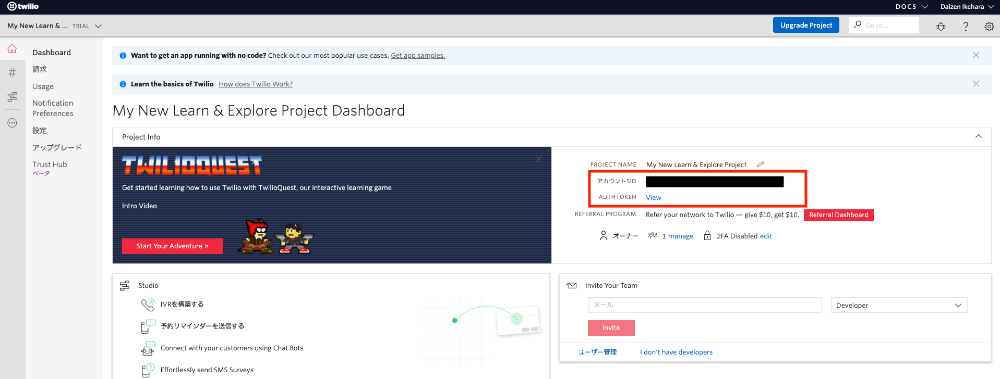
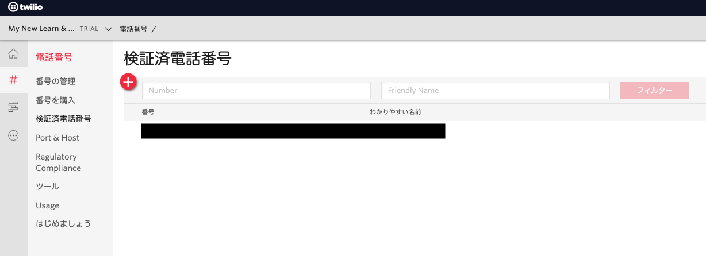
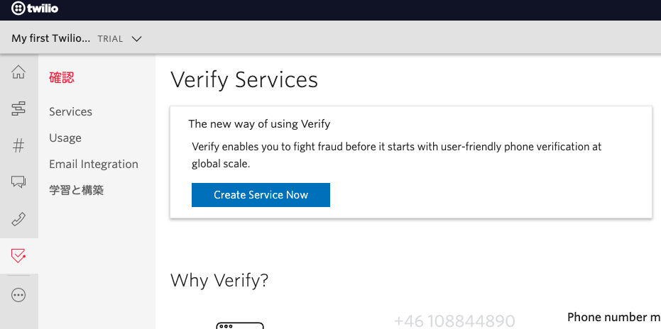
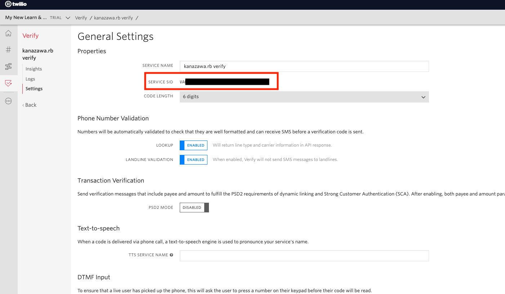

# 手順1: Twilioコンソールにアクセスし、資格情報の確認と生成を行う

この手順ではTwilioのサービスを利用するために必要な資格情報の確認方法とVerifyで利用するサービスの生成方法を体験します。

Verifyを利用するためには、次の3つの情報が必要です。

- Account Sid
- Auth Token
- Verification Sid（VerifyサービスのSid）

## 1-1. Twilioアカウント情報を確認

事前にTwilioアカウントを作成していない場合は下記の記事に従い、アカウントを作成します。

- [アカウントの作成方法](https://www.twilio.com/blog/how-to-create-twilio-account-jp)

Twilioが提供するサービスの多くはアカウント情報（`Account SID`, `Auth Token`）を利用し認証します。これらの情報は[コンソール](https://jp.twilio.com/console)から確認できます。(アカウントSID、AUTTOKEN)  
それぞれの値を控えておきましょう。

また、[検証済電話番号](https://jp.twilio.com/console/phone-numbers/verified)ページを開きSMSを受信可能な番号が登録されているかを確認します。登録されていない場合は`+`アイコンをクリックし新たに追加します。

## 1-2. Twilio Verifyサービスの作成

[Twilio Verify]()は二要素認証の仕組みを提供するサービスです。このサービスは主に次のような機能を持っています。

- 確認コードの生成
- __SMS、音声通話、Email、プッシュ通知__ でのコード通知
- 確認コードの検証

SMS、音声通話で通知する場合はTwilioがあらかじめ取得している電話番号を利用するため、改めて番号を取得する必要はありません。

この機能を利用するため、[Verify コンソール](https://jp.twilio.com/console/verify/services)を開きます。初期状態ではサービスが存在しないため、`Create Service Now`ボタンをクリックし、サービスを作成します。`FRIENDLY NAME`にはわかりやすい名前をつけておきます。

サービスを作成すると設定画面が表示されます。ここで`SERVICE SID`の値を控えておきます。そのほかの設定を変更する必要はありません。

いてAPIキーを作成します。[APIキー作成画面](https://www.twilio.com/console/project/api-keys/create)を表示します。

`FRIENDLY NAME`に作成する任意の名前を入力し、`KEY TYPE`を`Standard`と設定します。

次のハンズオンでこれらの情報を利用します。

## 次のハンズオン

- [ハンズオン: Webアプリケーションの準備と必要な情報を設定](/docs/02-Prep-WebApp/00-Overview.md)