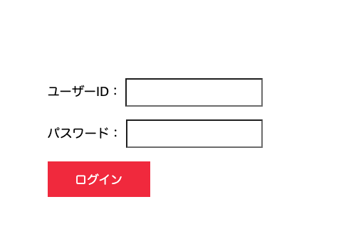
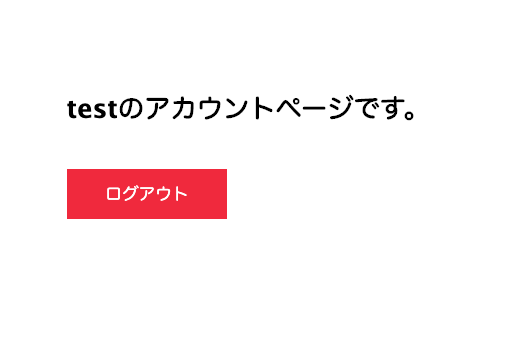

# 手順1: サンプルアプリケーションのクローンと実行

この手順ではあらかじめ実装されたID/パスワードで擬似的に認証するサンプルアプリケーションをクローンし、利用できるようにします。

## 1-1. login-demoアプリケーションをローカル環境にクローン

[login-demo](https://github.com/neri78/login-demo)リポジトリにはID/パスワードの認証フローが実装されているサンプルアプリケーションが用意されています。ターミナル/コマンドプロントを開き、任意のフォルダにクローンします。

```
git clone https://github.com/neri78/login-demo.git
```

クローン後、アプリケーションフォルダーに移動し必要なパッケージのインストールを行います。

```
cd login-demo
npm install
```

パッケージのインストールが完了した段階でアプリケーションを実行します。

```
npm start
```
アプリケーションを実行している最中に[http://localhost:3000/](http://localhost:3000/)をブラウザーで開くと次のようなログイン画面が表示されます。



次の資格情報でログインができます。

|  名前  |  値  |
| ---- | ---- |
|  ユーザーID  |  test  |
|  パスワード  |  20201017  |

ログイン後にアカウントページが表示されます。




## 次の手順

- [手順2: Twilio資格情報の追加](02-Add-Environment-Variables.md)