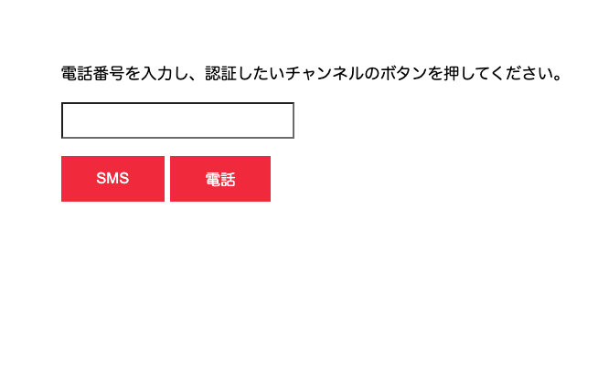

# 手順1: アプリケーションのルーティングにロールによる条件を追加する

サンプルアプリケーションではID/パスワードの認証後、アカウントページにアクセスできました。この手順ではさらに、特定のロールを取得したユーザーのみがアカウントページにアクセスできるようにルーティングを変更します。

## 1-1 アカウントページへのルーティング条件を変更

`/routes/account.js`はアカウントページへのルーティングを制御しています。現在は下記のようにトップページでログイン済みであることを条件としています。

```js
// アカウントページへのアクセス
// connect-ensure-loginを用いてドメインのトップページ ('/')でログイン済みの場合にaccountを表示
router.get('/', ensureLoggedIn('/'), (req, res) => {
  res.render('account', {user: req.user});
});
```

この条件を __ユーザーがログイン済み、かつ、制限されたコンテンツへのアクセスが可能な__ 場合にアクセスできるように変更します。

## 1-2. ロールを追加

`account.js`に`userRole.js`を追加します。

```js
const express = require('express');
const { ensureLoggedIn } = require('connect-ensure-login');
// 認可プロバイダーを追加
const userRoles = require('../userRoles');

const router = express.Router();
```

続けてアカウントページへのアクセス時にユーザーが`access restricted content`アクションを実行できるロールを有しているかを確認するコードに変更します。

```js
// アカウントページへのアクセス
// access restricted contentアクションが実行できるロールを持っている場合にaccountを表示
router.get('/', userRoles.can('access restricted content'), (req, res) => {
  res.render('account', {user: req.user});
});
```

今回のハンズオンでは既に認可プロバイダーが`userRoles.js`で実装されています。この認可プロバイダーでは二要素認証を終えていることを示す`2fa authenticated`ロールを持っている場合に`access restricted content`アクションが実行できると判断します。

もし実行できない場合は、二要素認証ページ(`/verify`)を表示させます。

```js
const ConnectRoles = require('connect-roles');

const userRoles = new ConnectRoles({
  // access restricted contentアクションに失敗した場合は二要素認証へと進む
  failureHandler(req, res, action) {
    if (action === 'access restricted content') {
      return res.redirect('/verify');
    }
    return res.status(403).send('Forbidden');
  },
});

// access restricted contentアクションが実行できるかを判断
userRoles.use('access restricted content', (req) => {
    if (req.user && req.user.role === '2fa authenticated') {
        return true;
    }
    return false;
});

module.exports = userRoles;
```

アプリケーションを実行し、ID/パスワード画面の次に二要素認証の画面へと遷移することを確認してください。



次の手順ではいよいよ二要素認証のための確認コードを送信します。

## 次の手順

[手順2: 確認コードの送信](02-Send-Verification-Code.md)