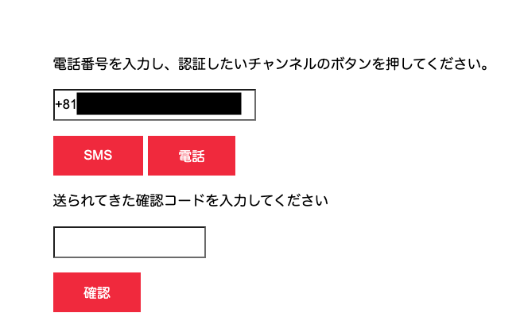

# 手順2: 確認コードの送信

この手順では[Twilio Verify](https://jp.twilio.com/verify)を用いて確認コードを送信します。

## 2-1. twilio-nodeヘルパーライブラリをインストール

Twilioの各種APIを利用できるサーバーアプリケーション用のヘルパーライブラリが __Node, Ruby, C#, Python, Java__ 向けとして提供されています。

コンソールを開き、プロジェクトフォルダで`twilio-node`をインストールします。

```
npm i twilio
```

## 2-2. TwilioクライアントをVerify.jsで利用

`Verify.js`内でTwilioクライアントを利用するため、初期化を行います。この際に環境変数からそれぞれの情報をロードしておきます。コメントで説明されている行を追加してください。

```js
const express = require('express');
const ensureLogin = require('connect-ensure-login');

//環境変数から値を取得
const {TWILIO_ACCOUNT_SID, TWILIO_AUTH_TOKEN, TWILIO_VERIFICATION_SID} = process.env;
//Twilioクライアントを初期化
const twilio = require('twilio')(TWILIO_ACCOUNT_SID, TWILIO_AUTH_TOKEN);

const router = express.Router();
```

このTwilioクライアントは`verify.js`の`POST`アクション時に利用されます。現在は何も実装されていません。

```js
// 二要素認証ページからPOSTされた際の処理
router.post('/', ensureLogin.ensureLoggedIn('/'), async (req, res) => {

});
```

## 2-3. 連絡先情報と利用チャネルの取得

`POST`時には連絡先となる電話番号が入力されています。また、それぞれのボタンに名前がついているため、SMSで認証するのか、それとも電話で認証するのかを判断します。

```js
// 二要素認証ページからPOSTされた際の処理
router.post('/', ensureLogin.ensureLoggedIn('/'), async (req, res) => {

  //2-2. 連絡先の取得
  let contact_to = req.body.contact_to;

  //2-2. チャネルを確認
  let channel;
  let bodyKeys = Object.keys(req.body);
  if (bodyKeys.find(i => i === 'sms'))
    channel = 'sms';
  else if (bodyKeys.find(i => i === 'call'))
    channel = 'call';

});
```

## 2-3. 確認コードを送信

連絡先情報とチャネル情報をもとに確認コードを送信します。

```js
// 二要素認証ページからPOSTされた際の処理
router.post('/', ensureLogin.ensureLoggedIn('/'), async (req, res) => {

  //2-2. 連絡先の取得
  let contact_to = req.body.contact_to;

  //2-2. チャネルを確認
  let channel;
  let bodyKeys = Object.keys(req.body);
  if (bodyKeys.find(i => i === 'sms'))
    channel = 'sms';
  else if (bodyKeys.find(i => i === 'call'))
    channel = 'call';

  //2-3. チャネルが指定されており、二要素認証を終えていない場合にコードを送信
  if (channel && req.user.role !== '2fa authenticated') {
    let verificationRequest;
    try {
      //指定の連絡先、チャネルに確認コードを送信。
      verificationRequest = await twilio.verify.services(TWILIO_VERIFICATION_SID)
        .verifications
        .create({ to: contact_to, channel: channel });
    } catch(e) {
      return res.status(500).send(e);
    }
    return res.render('verify', {user: req.user, contact_to: contact_to});
  }
  return res.render('verify', {user: req.user});
});
```

この段階でアプリケーションを実行すると、SMSもしくは音声通話で確認コードが送られてきます。また、ページに追加フィールドが表示されます。



次のハンズオンでは送られてきた確認コードを認証するロジックを実装します。

## 次のハンズオン

[ハンズオン: コードの認証](/docs/04-Verify-2FA-Code/00-Overview.md)


